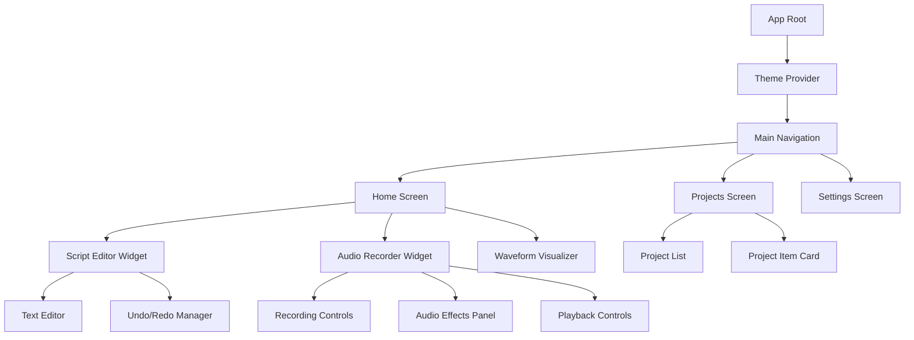
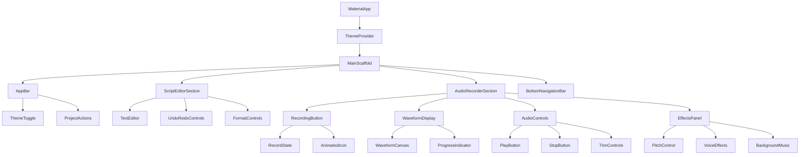
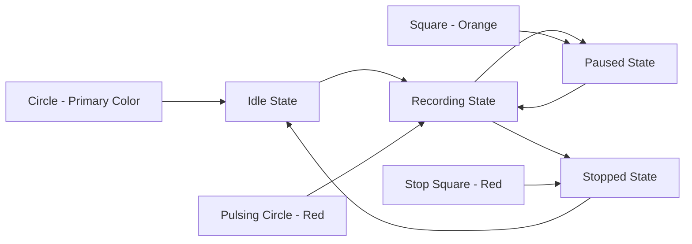
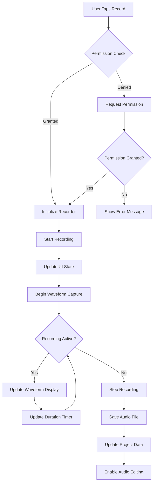
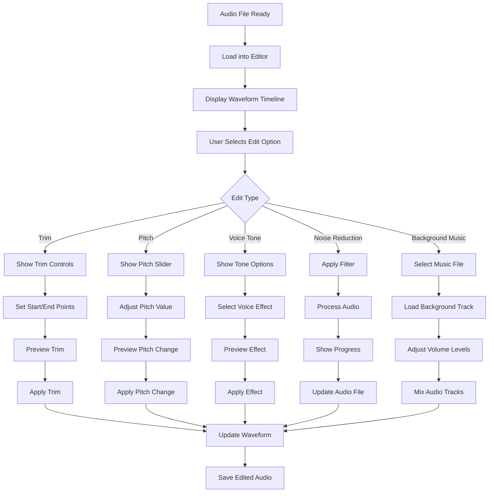
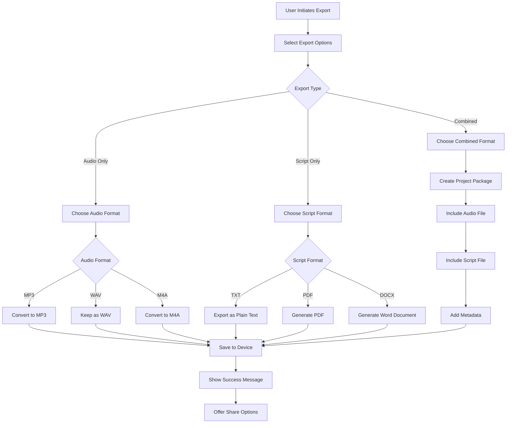

# Flutter Script and Audio Recorder App Design

## Overview

A modern Flutter mobile application that combines script writing with simultaneous audio recording capabilities. The app provides a comprehensive solution for content creators, podcasters, and voice-over artists who need to synchronize written scripts with audio recordings.

### Core Features
- Dual-pane interface: script editor + audio recorder
- Real-time waveform visualization during recording
- Advanced audio editing capabilities
- Material 3 design with dark/light theme support
- Project-based workflow with export and sharing options
- Professional audio effects and mixing tools

## Technology Stack & Dependencies

### Core Framework
- **Flutter SDK**: 3.16+ with Material 3 support
- **Dart**: 3.2+

### Audio & Media Processing
- **flutter_sound**: Audio recording and playback
- **audio_waveforms**: Real-time waveform visualization
- **ffmpeg_kit_flutter**: Audio format conversion and editing
- **just_audio**: Enhanced audio playback control

### UI & Animations
- **flutter/material**: Material 3 components
- **animations**: Smooth transitions and effects
- **lottie**: Animation assets for modern UI feel

### File Management & Export
- **path_provider**: Local storage access
- **file_picker**: File import functionality
- **pdf**: PDF script export
- **share_plus**: Sharing capabilities

### State Management
- **provider**: State management for app-wide data
- **shared_preferences**: Settings persistence

## Component Architecture

### Application Structure



### Core Components

#### 1. MainAppScreen
```dart
// Primary container managing script editor and audio recorder
class MainAppScreen extends StatefulWidget {
  // Manages overall app state and coordination between components
}
```

**Props/State:**
- `currentProject`: Active project data
- `isRecording`: Recording status
- `scriptText`: Current script content
- `audioFile`: Recorded audio reference

#### 2. ScriptEditorWidget
```dart
// Advanced text editor with formatting and history
class ScriptEditorWidget extends StatefulWidget {
  // Rich text editing with undo/redo capabilities
}
```

**Features:**
- Rich text editing with formatting options
- Undo/redo history management
- Auto-save functionality
- Word count and reading time estimation

#### 3. AudioRecorderWidget
```dart
// Comprehensive audio recording and editing interface
class AudioRecorderWidget extends StatefulWidget {
  // Handles all audio-related operations
}
```

**Components:**
- Circular recording button with animated states
- Waveform visualization canvas
- Audio editing controls panel
- Effects and mixing interface

#### 4. WaveformVisualizerWidget
```dart
// Real-time audio waveform display
class WaveformVisualizerWidget extends StatefulWidget {
  // Renders live audio visualization
}
```

**Rendering:**
- Real-time amplitude visualization
- Smooth animation updates
- Customizable colors and styles
- Recording progress indicator

### Component Hierarchy



## Routing & Navigation

### Navigation Structure
```dart
// App routing configuration
class AppRouter {
  static const String home = '/';
  static const String projects = '/projects';
  static const String settings = '/settings';
  static const String audioEditor = '/audio-editor';
  static const String export = '/export';
}
```

### Route Definitions
| Route | Widget | Purpose |
|-------|--------|---------|
| `/` | MainAppScreen | Primary editing interface |
| `/projects` | ProjectsListScreen | Project management |
| `/settings` | SettingsScreen | App configuration |
| `/audio-editor` | AudioEditorScreen | Advanced audio editing |
| `/export` | ExportScreen | File export options |

## Styling Strategy

### Material 3 Theme Implementation

```dart
// Theme configuration
class AppTheme {
  static ThemeData lightTheme = ThemeData(
    useMaterial3: true,
    colorScheme: ColorScheme.fromSeed(
      seedColor: Colors.deepPurple,
      brightness: Brightness.light,
    ),
  );
  
  static ThemeData darkTheme = ThemeData(
    useMaterial3: true,
    colorScheme: ColorScheme.fromSeed(
      seedColor: Colors.deepPurple,
      brightness: Brightness.dark,
    ),
  );
}
```

### Design Tokens

| Token | Light Value | Dark Value | Usage |
|-------|-------------|------------|-------|
| Primary | #6750A4 | #D0BCFF | Recording button, accents |
| Surface | #FFFBFE | #1C1B1F | Card backgrounds |
| OnSurface | #1C1B1F | #E6E1E5 | Text, icons |
| SurfaceVariant | #F4EFF4 | #49454F | Editor background |

### Component Styling

#### Recording Button Design


#### Waveform Visualization
- **Active Bars**: Primary color with opacity gradient
- **Inactive Bars**: Surface variant with 30% opacity
- **Animation**: Smooth 60fps updates during recording
- **Height**: Amplitude-based scaling (0-100% of container)

## State Management

### Provider Architecture

```mermaid
graph TB
    A[ChangeNotifierProvider] --> B[ThemeProvider]
    A --> C[ProjectProvider]
    A --> D[AudioProvider]
    A --> E[ScriptProvider]
    
    B --> F[isDarkMode]
    B --> G[toggleTheme()]
    
    C --> H[currentProject]
    C --> I[projectsList]
    C --> J[saveProject()]
    C --> K[loadProject()]
    
    D --> L[isRecording]
    D --> M[audioFile]
    D --> N[waveformData]
    D --> O[startRecording()]
    D --> P[stopRecording()]
    
    E --> Q[scriptText]
    E --> R[undoStack]
    E --> S[redoStack]
    E --> T[performUndo()]
    E --> U[performRedo()]
```

### State Classes

#### AudioProvider
```dart
class AudioProvider extends ChangeNotifier {
  RecordingState _state = RecordingState.idle;
  List<double> _waveformData = [];
  Duration _recordingDuration = Duration.zero;
  
  // Methods for recording control
  Future<void> startRecording();
  Future<void> pauseRecording();
  Future<void> resumeRecording();
  Future<void> stopRecording();
}
```

#### ProjectProvider
```dart
class ProjectProvider extends ChangeNotifier {
  Project? _currentProject;
  List<Project> _projects = [];
  
  // Project management methods
  Future<void> createProject(String name);
  Future<void> saveCurrentProject();
  Future<void> loadProject(String id);
  Future<void> exportProject(ExportFormat format);
}
```

## API Integration Layer

### Audio Processing Services

#### RecordingService
```dart
class RecordingService {
  static const String _audioPath = 'recordings/';
  
  Future<String> startRecording({
    AudioFormat format = AudioFormat.wav,
    int sampleRate = 44100,
  });
  
  Future<void> stopRecording();
  Stream<List<double>> getWaveformStream();
}
```

#### AudioEditingService
```dart
class AudioEditingService {
  Future<String> trimAudio(String inputPath, Duration start, Duration end);
  Future<String> adjustPitch(String inputPath, double pitchFactor);
  Future<String> changeVoiceTone(String inputPath, VoiceTone tone);
  Future<String> addNoiseReduction(String inputPath);
  Future<String> mixWithBackground(String voicePath, String backgroundPath);
}
```

### File Management Services

#### ProjectStorageService
```dart
class ProjectStorageService {
  static const String _projectsPath = 'projects/';
  
  Future<void> saveProject(Project project);
  Future<Project> loadProject(String projectId);
  Future<List<Project>> getAllProjects();
  Future<void> deleteProject(String projectId);
}
```

#### ExportService
```dart
class ExportService {
  Future<String> exportAudio(String audioPath, AudioFormat format);
  Future<String> exportScript(String text, ScriptFormat format);
  Future<String> exportCombined(Project project, CombinedFormat format);
}
```

## Data Models & Storage

### Core Data Models

#### Project Model
```dart
class Project {
  final String id;
  final String name;
  final String scriptText;
  final String? audioFilePath;
  final DateTime createdAt;
  final DateTime updatedAt;
  final ProjectSettings settings;
  
  // Serialization methods
  Map<String, dynamic> toJson();
  factory Project.fromJson(Map<String, dynamic> json);
}
```

#### AudioSettings Model
```dart
class AudioSettings {
  final AudioFormat format;
  final int sampleRate;
  final int bitRate;
  final bool noiseReduction;
  final double pitchAdjustment;
  final VoiceTone voiceTone;
  
  Map<String, dynamic> toJson();
  factory AudioSettings.fromJson(Map<String, dynamic> json);
}
```

#### Script Model
```dart
class Script {
  final String content;
  final List<TextSpan> formattedSpans;
  final int wordCount;
  final Duration estimatedReadingTime;
  
  Map<String, dynamic> toJson();
  factory Script.fromJson(Map<String, dynamic> json);
}
```

### Local Storage Schema

#### SQLite Database Schema
```sql
-- Projects table
CREATE TABLE projects (
  id TEXT PRIMARY KEY,
  name TEXT NOT NULL,
  script_text TEXT,
  audio_file_path TEXT,
  created_at INTEGER NOT NULL,
  updated_at INTEGER NOT NULL,
  settings_json TEXT
);

-- Audio files metadata
CREATE TABLE audio_files (
  id TEXT PRIMARY KEY,
  project_id TEXT,
  file_path TEXT NOT NULL,
  duration INTEGER,
  format TEXT,
  file_size INTEGER,
  FOREIGN KEY (project_id) REFERENCES projects (id)
);
```

## Business Logic Layer

### Recording Workflow



### Audio Editing Workflow



### Export Workflow



## Testing Strategy

### Unit Testing Structure

#### Audio Service Tests
```dart
group('AudioRecordingService', () {
  test('should start recording successfully', () async {
    // Test recording initialization
  });
  
  test('should generate waveform data during recording', () async {
    // Test waveform stream
  });
  
  test('should save audio file with correct format', () async {
    // Test file saving
  });
});
```

#### Script Editor Tests
```dart
group('ScriptEditorProvider', () {
  test('should handle undo/redo operations correctly', () {
    // Test history management
  });
  
  test('should save script content automatically', () {
    // Test auto-save functionality
  });
  
  test('should calculate word count accurately', () {
    // Test text analysis
  });
});
```

### Widget Testing

#### Recording Button Tests
```dart
group('RecordingButton Widget', () {
  testWidgets('should change state when tapped', (tester) async {
    // Test button state transitions
  });
  
  testWidgets('should show correct animation for each state', (tester) async {
    // Test UI animations
  });
});
```

#### Waveform Visualizer Tests
```dart
group('WaveformVisualizer Widget', () {
  testWidgets('should render waveform data correctly', (tester) async {
    // Test waveform rendering
  });
  
  testWidgets('should update smoothly during recording', (tester) async {
    // Test real-time updates
  });
});
```

### Integration Testing

#### End-to-End Scenarios
```dart
group('Complete Recording Workflow', () {
  testWidgets('should record, edit, and export audio successfully', (tester) async {
    // Test complete user journey
  });
  
  testWidgets('should save and load projects correctly', (tester) async {
    // Test project persistence
  });
});
```

### Performance Testing

#### Audio Processing Performance
- Recording latency: < 50ms initialization
- Waveform updates: 60fps during recording
- Audio editing operations: < 2s for 1-minute audio
- Export operations: < 5s for standard formats

#### Memory Usage Monitoring
- Base app memory: < 100MB
- During recording: < 150MB additional
- Large project handling: < 500MB total
- Memory leak prevention in audio streams